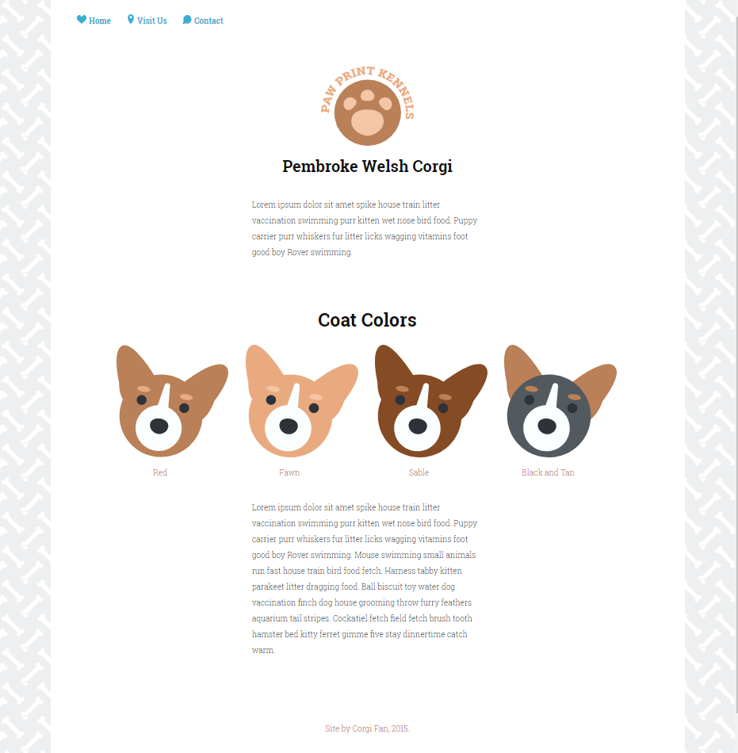
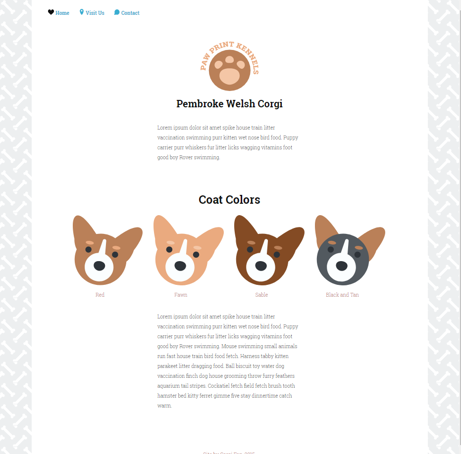

# SVG Site Update

This is the project #6 of TeamTreehouse Techdegree. In this project, an initial website was given, and I have to update its image to svg format according to the [project_instructions.pdf](https://github.com/wahidyankf/treehouse-frontend-06-svg-site-update/blob/master/project_instructions.pdf). This project was tested in safari, chrome, and firefox. You can find the final website [here](https://wahidyankf.github.io/treehouse-frontend-06-svg-site-update/index.html).

## Note

1. This project was tested in safari, chrome, and firefox.
2. I leave the original css and svg inline styling intact.

## Screenshots

### Home

### Home with heart nav icon hovered

## Usage

Open the index.html via browser.

## License

[MIT License](https://en.wikipedia.org/wiki/MIT_License).